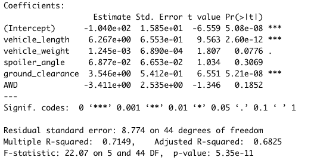
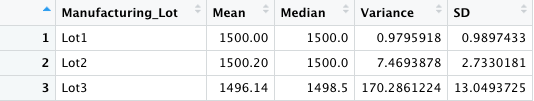
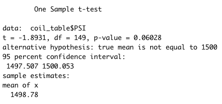
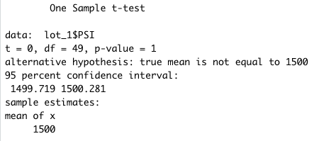
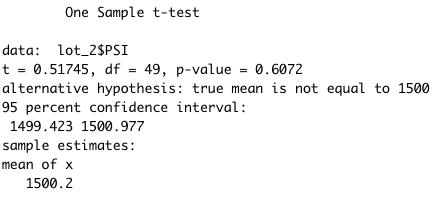
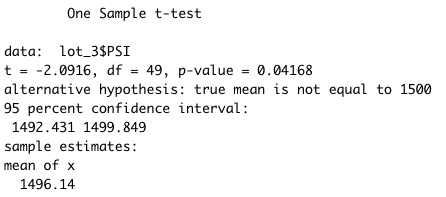

# MechaCar_statistical_analysis

## Linear Regression to Predict MPG

Based on the results of the linear regression both vehicle weight and ground clearance provide a non-random amount of variance to the mpg value in t"he dataset. This is determined by looking at the p-value which is less than 0.05. 
This non-random amount of variance in these variables gives significant evidence to reject the null hypothesis that the slope of the linear model is zero.
The linear model is a relatively good predictor of MechaCar mpg as the r squared value is .7149. The closer this value is to 1.0, the higher the probability that future data will fit the linear model. an r value above 0.7 is considered to be a strong correlation. 

## Summary Statistics on Suspension Coils

**Lot Summary**

**Total Summary**

In total all manufacturing lots meet the MechaCar design specifications for suspension coils. The specifications dictate that variance is not to exceed 100 PSI, and the total variance for the data set is 62.29. However not all lots individually meet the specifications. Lots 1 and 2 do with variances of 0.98 and 7.47 respectively. Lot 3, on the other hand, has a variance of 170.29 which exceeds the design specifications of 100 PSI. 

## T-Tests on Suspension Coils

**All manufacturing lots t-test**

**lot 1 t-test**

**lot 2 t-test**

**lot 3 t-test** 

In the t-test comparing PSI in all manufacturing lots against mean PSI of the population, we fail to reject the null hypothesis as there is not enough evidence of a significant difference in means. the p-value is greater than 0.05. The same is true for lots 1 and 2 when t-testing them individually against the population mean. In both cases we fail to reject the null hypothesis, as both means are not significantly different from the population. Again, the p-values exceeds 0.05. In the t-test of lot 3, the null hypothesis is rejected in favor of the alternative. There is a significant difference in population PSI compared to lot 3 mean PSI. The p-value is less than 0.05. 

## Study Design: MechaCar vs Competition
This study will test MechaCar’s reliability compared to the competition. We will use cost of repair for vehicle warranty claims grouped by the vehicle's manufacturer. 

H0: The mean repair costs for MechaCar are equal to the repair cost of the competition; µ1 = µ2
Ha: The mean repair costs of MechaCar and the competition are not equal; µ1 ≠ µ2

A two-sample t-test will be used to compare the means of the 2 different samples (MechaCar and the Competition) and determine if there is a significant difference. The data we will need to run this test is a list of vehicle warranty claims from each manufacturer and the cost for each of those claims. The results will tell us if there is a significant difference in the cost of warranty claims to the manufacturers. If there is a significant difference and we reject or null hypothesis, we can conclude that the manufacture with lower repair costs is the more reliable car manufacturer.
This test could also be done using an ANOVA if we want to compare MechaCar to multiple different manufacturers. 

